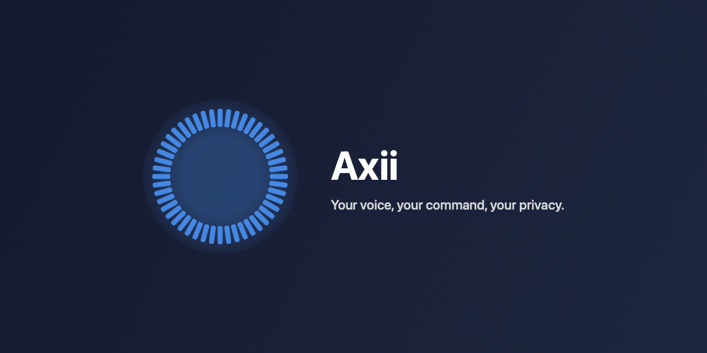
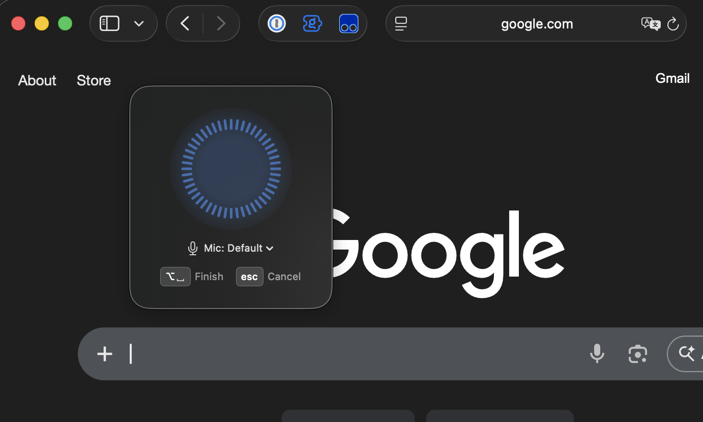

<p align="center">
  
</p>

# Axii

Axii is a macOS menu bar app for voice-to-text dictation and meeting
transcription. Press a hotkey, speak, and your words are transcribed and
pasted wherever your cursor is. Record an hour-long meeting and get a
speaker-attributed transcript. Everything runs locally on your Mac — no
cloud, no subscriptions, no data leaving your device.

And it is built around one promise: **a recording you make is a recording
you keep.** Nothing is worse than an app that dies 30 minutes into a
meeting — so Axii is engineered, tested, and continuously proven not to.

## Features

- **Hotkey-triggered** — press a global hotkey to start/stop recording
- **Local transcription** — powered by NVIDIA Parakeet, runs entirely on
  your Mac
- **Instant paste** — text appears at your cursor automatically
- **Meeting recording** — capture the microphone and app audio together,
  with speaker-attributed transcripts (diarization runs locally too)
- **Conversation mode** — multi-turn dictation with an optional local or
  Bedrock-backed LLM step
- **History** — every dictation and meeting saved locally, searchable,
  with original audio and one-click re-transcription

## Bulletproof transcription

Reliability here is not a promise — it is a tested invariant. What that
means in practice:

- **Crash-proof from second zero.** A meeting's audio and transcript are
  spooled to disk from the moment recording starts and autosaved
  continuously. Force-quit the app, `kill -9` it, kernel-panic the
  machine — the next launch recovers the meeting into history under its
  original date.
- **Recoverable for a week.** Crash artifacts survive for 7 days, so a
  laptop that dies on Friday still hands you the meeting on Monday.
- **Mistakes are reversible.** Discarding a live meeting (Escape, close,
  or switching modes) moves it to *Recently Deleted* — audio and
  transcript intact, restorable with one click for 7 days.
- **Protected while it matters.** During a live meeting, a stray Escape
  is ignored and the close button isn't offered; a save in progress
  refuses exits until your data is durably on disk. Sleep/wake, device
  switches, and Bluetooth mic hiccups are handled without losing what
  was already captured.
- **Light on your machine.** Stopping a 60-minute dual-track meeting was
  measured at a **0.28 GB** peak memory spike — and a regression test
  keeps it that way.

### Proven, not promised

Every change to Axii must pass a layered reliability gate:

- **286 unit and integration tests**, including a crash-recovery matrix
  that simulates dying at every lifecycle point
- **Schedule fuzzers** that explore tens of thousands of seeded
  async-interleaving schedules per nightly run — every hotkey press,
  cancel, device switch, and error timing — checking that no audio is
  ever silently lost and no recording is ever left running unowned
- **A real-UI end-to-end suite**: synthetic hotkeys drive the actual
  app, real audio flows through a virtual device into the real
  transcription models, and the suite asserts on what lands on disk —
  including a scenario that `kill -9`s the app mid-meeting and verifies
  the recovery
- **ThreadSanitizer sweeps** and an opt-in hour-long memory soak

The full reliability model — the invariants, the harness layers, and
the bugs they caught — is documented in
[docs/meeting-reliability-model.md](docs/meeting-reliability-model.md).

## Screenshots

| Listening | Transcribed |
|:-:|:-:|
|  |  |
| *Press hotkey to start recording* | *Text transcribed and entered automatically* |

## Requirements

- macOS 15.6+
- Apple Silicon Mac (M1/M2/M3/M4)

## Installation

### Download (Recommended)

1. Download the latest `Axii.dmg` from [Releases](https://github.com/bwarzecha/Axii/releases)
2. Open the DMG and drag Axii to Applications
3. Launch Axii from Applications
4. Grant microphone and accessibility permissions when prompted

### Build from Source

```bash
git clone https://github.com/bwarzecha/Axii.git
git clone https://github.com/bwarzecha/AxiiDiarization.git   # sibling package
cd Axii
open Axii.xcodeproj
```

## Acknowledgments

Axii is built on the shoulders of these excellent projects:

- [FluidAudio](https://github.com/FluidInference/FluidAudio) - Swift ASR framework
- [NVIDIA Parakeet](https://huggingface.co/nvidia/parakeet-tdt-0.6b-v2) - Speech recognition model
- [HotKey](https://github.com/soffes/HotKey) - Global hotkey handling by Sam Soffes
- [AWS SDK for Swift](https://github.com/awslabs/aws-sdk-swift) - Bedrock integration
- [PyAnnote](https://github.com/pyannote/pyannote-audio) - Speaker diarization

## License

Apache-2.0
