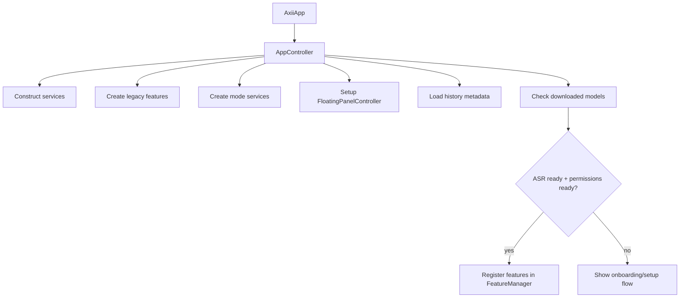

# Axii Refactor Design And Contractor Handoff

## Purpose

This document is for an engineer who is new to Axii and has not worked on this codebase before.

The goals are:

1. Explain how the repository works today.
2. Identify the files and runtime paths that matter most.
3. Call out the highest-risk architectural and product issues.
4. Propose a concrete, phased refactor plan that improves testability without destabilizing the app.

This is intentionally critical and specific. It is not a marketing overview.

## Product Summary

Axii is a macOS menu bar application for voice capture and transcription. The main product capabilities are:

- Dictation: capture microphone audio, transcribe it locally, then insert or copy text.
- Conversation: capture speech, transcribe it, send it to an LLM, and display the response.
- Meeting capture: capture microphone plus system audio, transcribe live or after stop, and persist meeting history.

The app is a hybrid SwiftUI + AppKit app:

- SwiftUI is used for most windows and views.
- AppKit is used for the floating panel, menu bar plumbing, hotkeys, permissions, Accessibility, and audio/system integrations.

## Product Mental Model

If you are new to the project, think of Axii as a local-first voice utility that lives in the macOS menu bar and exposes several voice workflows through hotkeys.

The core interaction pattern is:

- user triggers a mode with a hotkey
- Axii shows a floating HUD-style panel
- Axii records audio
- Axii transcribes locally
- Axii performs mode-specific output actions

Those output actions may include:

- pasting text into the currently focused app
- copying text to the clipboard
- displaying text in the panel
- saving interaction history
- sending transcribed text through an LLM
- capturing and saving a meeting transcript

The app is intentionally local-first:

- speech recognition runs locally
- history is stored locally
- only the LLM portion of conversation-like modes may leave the machine, depending on provider configuration

### What users actually see

The main user-visible surfaces are:

- Menu bar item
  Entry point for settings, history, onboarding/setup, updates, and quit.
- Onboarding/setup window
  Walks the user through permissions and model downloads.
- Floating panel
  The main recording HUD for dictation, conversation, and meeting workflows.
- Settings window
  Contains general settings plus built-in and custom mode editing.
- History window
  Displays prior dictations, conversations, and meetings, with playback/copy/delete actions.

### Core product concepts

- Mode
  A user-configurable preset that defines capture, processing, output, and panel behavior.
- Built-in mode
  Shipped by the app: Dictation, Conversation, Meeting.
- Custom mode
  User-created mode, edited in settings, persisted as JSON.
- Floating panel
  Non-activating HUD that shows status and controls while a mode is active.
- History
  Local archive of interactions.
- Focus snapshot
  Captured UI focus/app state used to avoid pasting into the wrong place and to provide context.

### User journeys

#### First run

Typical first-run flow:

1. App launches in the menu bar.
2. Setup/onboarding appears if requirements are missing.
3. User grants microphone permission.
4. User grants Accessibility permission.
5. User downloads ASR models.
6. App prepares the transcription service and activates runtime features.

#### Dictation

Typical dictation flow:

1. User focuses another macOS app or text field.
2. User presses the dictation hotkey.
3. Floating panel appears and recording starts immediately.
4. User speaks and presses the hotkey again.
5. Axii transcribes locally.
6. Axii pastes or copies the result depending on configuration.
7. Axii optionally saves the interaction to local history.

#### Conversation

Typical conversation flow:

1. User presses the conversation hotkey.
2. Axii records from the microphone.
3. Axii transcribes the utterance.
4. Axii sends the text to the configured LLM provider.
5. Axii shows the assistant response in the panel and may continue the session.

#### Meeting

Typical meeting flow:

1. User opens the meeting panel.
2. User selects or confirms the source app/system audio and microphone.
3. User starts recording manually.
4. Axii records microphone + system audio, optionally showing live transcript updates.
5. User stops the meeting.
6. Axii finalizes transcription, diarization, and history persistence.

### Permission model

The app depends on several macOS permissions. This is essential context for any engineer changing behavior.

- Microphone
  Required for dictation, conversation, and meeting capture.
- Accessibility
  Required for insertion/paste behavior and focus-aware interaction with other apps.
- Screen Recording
  Required for meeting mode system-audio capture through ScreenCaptureKit.
- Input Monitoring
  Required only for advanced hotkey mode, which adds Fn-key support.

Any change touching onboarding, hotkeys, paste behavior, or meeting capture should assume that permission edge cases are a primary source of real-world bugs.

## Environment And Dependency Notes

### Build / runtime assumptions

- Platform: macOS only.
- Minimum OS: macOS 15+.
- Hardware: Apple Silicon.
- Build system: Xcode project, not a Swift Package app.
- Entry point: `Axii.xcodeproj`.

### External package dependencies

The Xcode project pulls in several Swift packages:

- `HotKey`
- `FluidAudio`
- `aws-sdk-swift`
- `Sparkle`
- Local package: `../AxiiDiarization`

Important: the local `AxiiDiarization` package means this repository is not fully standalone. A contractor cannot build the full app unless that sibling checkout exists.

### Runtime data stored outside the repo

Several important runtime artifacts are written to `~/Library/Application Support/Axii`:

- `Modes/` for persisted `ModeConfig` JSON files
- `Models/` for downloaded ASR and diarization models
- `history/` for interaction history and audio attachments
- `meeting_autosave.json` for crash recovery

This matters because changing code in the repo does not necessarily change existing runtime data on disk.

### Practical setup requirements for a new engineer

A contractor with zero context will need all of the following before the app behaves normally:

- Xcode and the project’s package dependencies resolved
- access to the local `../AxiiDiarization` package
- model downloads completed or already present in Application Support
- microphone permission granted
- Accessibility permission granted
- Screen Recording permission granted if testing meeting mode
- Input Monitoring permission granted if testing advanced hotkey mode

Without these prerequisites, many parts of the app can appear broken even when the code is functioning as designed.

### How to run the app locally

For a new engineer, the shortest path is:

1. Ensure the sibling `../AxiiDiarization` package exists.
2. Open `Axii.xcodeproj` in Xcode.
3. Resolve Swift package dependencies.
4. Build and run the app target.
5. Expect the onboarding flow on a fresh machine.
6. Grant permissions and download models before judging runtime behavior.

Do not assume a successful build means the product is functionally ready. The permission and model state are part of the real runtime environment.

## Repository Map

### Top-level structure

- `Axii/`
  The application source.
- `Axii.xcodeproj/`
  Xcode project and scheme configuration.
- `README.md`
  Product-level overview, install notes.
- `TESTING.md`
  Existing testing strategy proposal. Useful context, but not aligned with the codebase’s actual readiness.

### Product-facing source areas

If the engineer needs to navigate by product feature instead of technical layer, use this map:

- Startup and shell
  `Axii/AxiiApp.swift`, `Axii/Core/`
- Onboarding and setup
  `Axii/UI/OnboardingView.swift`, `Axii/UI/ModelDownloadPage.swift`
- Active mode runtime
  `Axii/Features/Mode/`
- Legacy runtime
  `Axii/Features/Dictation/`, `Axii/Features/Conversation/`, `Axii/Features/Meeting/`
- Settings and mode editing
  `Axii/UI/Settings/`
- History UI
  `Axii/UI/History/`
- Audio and platform services
  `Axii/Services/Audio/`, `Axii/Services/Paste/`, `Axii/Services/Permissions/`

### Main source folders

- `Axii/AxiiApp.swift`
  SwiftUI app entry point and window declarations.
- `Axii/Core/`
  Global coordinators such as app startup and feature registration.
- `Axii/Features/`
  Feature runtimes and feature-specific UI.
- `Axii/Services/`
  Platform, persistence, model download, hotkey, audio, LLM, and pipeline services.
- `Axii/UI/`
  Shared app windows and non-feature-specific views.
- `Axii/Models/`
  Persisted interaction and history models.

## How The App Works Today

### High-level startup flow

### App entry and windows

`Axii/AxiiApp.swift` builds the app shell:

- Creates `AppController`.
- Declares menu bar UI.
- Declares setup/onboarding, settings, history, and credits windows.
- Uses window scenes for settings/history/onboarding, plus a custom AppKit floating panel for active feature UI.

The app shell therefore has two kinds of UI:

- standard SwiftUI windows owned by scene declarations
- one shared AppKit floating panel whose content is swapped based on the active feature

Current architectural problem:

- The menu bar now reads the active mode runtime after Phase 1.
- The remaining app-shell problem is that `AppController` still constructs legacy feature objects even though startup and shipping behavior are mode-runtime-driven.
- That means the app shell still carries two runtime architectures even after the most visible UI dependency was fixed.

### AppController

`Axii/Core/AppController.swift` is the effective root composition object.

Responsibilities:

- Instantiates nearly all services.
- Creates both the legacy feature set and the mode system objects.
- Wires settings callbacks.
- Starts model readiness checks.
- Loads history metadata.
- Registers runtime features once onboarding/model requirements are satisfied.

Important detail:

- `useModeSystem` is hardcoded to `true`.
- Even with that set, the controller still instantiates the legacy `DictationFeature`, `ConversationFeature`, and `MeetingFeature`.

This means the codebase currently carries two runtime architectures:

1. Legacy feature-specific runtime classes.
2. Newer config-driven mode runtime.

Only one is active, but both still exist and influence the codebase shape.

### FeatureManager and floating panel

`Axii/Core/FeatureManager.swift` is a very small lifecycle coordinator:

- registers feature hotkeys
- ensures only one feature is active
- swaps panel content
- handles `Escape`

`Axii/UI/FloatingPanel.swift` owns the non-activating AppKit floating panel:

- always-on-top HUD-style panel
- content replaced dynamically with SwiftUI views
- does not become key/main window

This split is simple and generally acceptable. The larger issue is that the feature implementations themselves own too much orchestration logic.

## Active Runtime Architecture

### The active direction: mode system

The newer mode-driven architecture lives under:

- `Axii/Features/Mode/Config/`
- `Axii/Features/Mode/Runtime/`
- `Axii/Features/Mode/UI/`
- `Axii/Services/Mode/ModeService.swift`

Core idea:

- `ModeConfig` defines how a mode behaves.
- `ModeService` loads/saves mode JSON from Application Support.
- `ModeFeature` is a generic runtime object driven by `ModeConfig`.

That is the right long-term direction. However, the mode system is only partially generic in practice.

### Mode config and persistence

`Axii/Features/Mode/Config/ModeConfig.swift` defines:

- capture mode
- transcription mode
- diarization settings
- processing pipeline steps
- outputs
- lifecycle behavior
- panel preferences

This is not just a technical abstraction. It is a product abstraction. The settings UI exposes these configs to the user through the mode editor, including:

- name and icon
- hotkey
- audio input behavior
- transcription mode
- processing steps
- outputs
- panel behavior

Refactoring the mode runtime therefore affects a user-facing configuration model that is already persisted to disk.

`Axii/Features/Mode/Config/DefaultModes.swift` defines the built-in Dictation, Conversation, and Meeting mode configs.

`Axii/Services/Mode/ModeService.swift` persists them under Application Support.

Critical behavior that is easy to miss:

- built-in mode JSON files are only written if they do not already exist
- changing `DefaultModes.swift` does not update existing user installations automatically
- a contractor changing built-in mode defaults must either:
  - delete/reset persisted mode files manually, or
  - add migration/update logic

This is one of the most important hidden behaviors in the repo.

### ModeFeature runtime

`Axii/Features/Mode/Runtime/ModeFeature.swift` is the generic feature shell.

It owns:

- a `ModeConfig`
- runtime state via `ModeRuntimeState`
- injected services
- optional specialized handlers:
  - `ConversationHandler`
  - `MeetingPipelineHandler`
- recording helper and deactivation timer
- selected microphone persistence via `UserDefaults`

Supporting runtime files:

- `ModeFeatureRecording.swift`
  Single-shot and multi-turn recording/transcription flow.
- `ModeFeatureMeeting.swift`
  Meeting-specific behavior that bypasses much of the generic output flow.
- `ConversationHandler.swift`
  LLM + conversation history persistence.
- `OutputHandler.swift`
  Paste/clipboard/file/history output execution.

### Legacy runtime still present

Legacy feature classes still exist and are sizable:

- `Axii/Features/Dictation/DictationFeature.swift`
- `Axii/Features/Conversation/ConversationFeature.swift`
- `Axii/Features/Meeting/MeetingFeature.swift`

These classes duplicate major portions of the mode runtime logic:

- microphone capture
- transcription preparation
- state changes
- error handling
- deactivation timers
- history persistence
- app/mic switching

This is one of the main reasons the repository feels scattered.

## Core Runtime Flows

### Dictation flow

Main active code path:

- `ModeFeature.handleSingleShotHotkey`
- `ModeFeatureRecording.startSimpleRecording`
- `RecordingSessionHelper`
- `TranscriptionService`
- `PipelineRunner`
- `OutputHandler`
- `PasteService`
- `HistoryService`

Flow:

1. Capture focus context if enabled.
2. Optionally pause media.
3. Start microphone recording through `RecordingSessionHelper`.
4. Transcribe captured samples through `TranscriptionService`.
5. Run optional processing pipeline.
6. Execute outputs:
   - paste at cursor
   - copy to clipboard
   - display
   - write file
   - save history
7. Update panel state and auto-dismiss if configured.

What works well:

- `PipelineRunner` and `OutputHandler` are real architectural seams.
- `ModeConfig` makes dictation behavior more declarative.

What does not:

- `ModeFeatureRecording` still mixes state transitions with `Task`, timers, permission effects, focus capture, and media control.
- It is not unit-test-friendly in current form.

### Conversation flow

Main active code path:

- `ModeFeature.handleMultiTurnHotkey`
- `ModeFeatureRecording.stopAndProcessMultiTurn`
- `ConversationHandler`
- `LLMService`
- `HistoryService`

Flow:

1. Capture microphone audio.
2. Transcribe locally.
3. Save user message to conversation history.
4. Send either the raw message or the prior conversation history to the LLM.
5. Persist assistant reply.
6. Update panel state with display messages.

Important implementation note:

- `LLMService` only actually supports AWS Bedrock today.
- OpenAI and Anthropic provider cases exist in settings enums but are not implemented.
- Conversation mode is therefore partially product-configurable in the UI, but effectively single-provider in the current implementation.

### Meeting flow

Main active code path:

- `ModeFeatureMeeting`
- `MeetingPipelineHandler`
- `MeetingAudioManager`
- `MeetingTranscriptManager`
- `TranscriptionService`
- `DiarizationService`
- `HistoryService`

Flow:

1. Check microphone and screen recording permissions.
2. Start combined mic + system audio capture.
3. Stream original-quality audio to temp files.
4. Optionally transcribe chunks live.
5. Optionally run streaming diarization.
6. On stop:
   - cancel pending chunk work
   - read original audio from temp files
   - finalize diarization
   - transcribe segments
   - update speaker profiles
   - save meeting history

This is the most complex and highest-risk part of the app.

Important behavior:

- `MeetingAudioManager` writes raw temporary audio files in the temp directory for reliability.
- `MeetingTranscriptManager` auto-saves meeting transcript state every 60 seconds.
- crash recovery reads `meeting_autosave.json` if it is recent enough.

### Onboarding and model download

Relevant files:

- `Axii/UI/OnboardingView.swift`
- `Axii/UI/ModelDownloadPage.swift`
- `Axii/Services/Download/ModelDownloadService.swift`
- `Axii/Services/TranscriptionService.swift`

Behavior:

- ASR models are required.
- diarization models are optional.
- downloaded models are stored in Application Support.
- after model readiness, `TranscriptionService.prepare` loads the model into memory.

This matters in practice:

- a fresh machine may fail simply because models have not been downloaded yet
- a previously used machine may behave differently because models are already present
- onboarding is part of real product behavior, not just developer setup

### History and playback

Relevant files:

- `Axii/Services/History/HistoryService.swift`
- `Axii/UI/History/HistoryView.swift`
- `Axii/UI/History/HistoryDetailView.swift`

History storage model:

- one folder per interaction
- `metadata.json`
- `interaction.json`
- optional `audio/` directory for recordings

History list reads metadata cache. Full interaction data is loaded on demand.

## Key Files And Why They Matter

| File | Role | Why it matters |
| --- | --- | --- |
| `Axii/AxiiApp.swift` | App entry, scene declarations | Defines windows and currently leaks legacy runtime state into the active UI |
| `Axii/Core/AppController.swift` | Root composition object | Startup, service creation, onboarding gating, feature registration |
| `Axii/Core/FeatureManager.swift` | Feature activation coordinator | Controls panel content and active feature ownership |
| `Axii/Features/Mode/Config/ModeConfig.swift` | Runtime behavior schema | Defines the target abstraction for the app |
| `Axii/Features/Mode/Config/DefaultModes.swift` | Built-in default modes | Source defaults for dictation/conversation/meeting |
| `Axii/Services/Mode/ModeService.swift` | Mode persistence/migration | Hidden source of truth because persisted JSON overrides code defaults |
| `Axii/Features/Mode/Runtime/ModeFeature.swift` | Generic runtime shell | Central mode runtime object and likely long-term source of truth |
| `Axii/Features/Mode/Runtime/ModeFeatureRecording.swift` | Dictation/conversation recording flow | Good extraction point for testable post-capture mode execution |
| `Axii/Features/Mode/Runtime/ModeFeatureMeeting.swift` | Meeting-specific mode runtime | Demonstrates that the mode system is not fully generic yet |
| `Axii/Features/Mode/Runtime/MeetingPipelineHandler.swift` | Meeting orchestration | High complexity, large file, multiple responsibilities |
| `Axii/Features/Mode/Runtime/OutputHandler.swift` | Output execution | One of the cleaner seams in the codebase |
| `Axii/Services/Pipeline/PipelineRunner.swift` | Processing pipeline runner | Another clean seam and early test target |
| `Axii/Services/Audio/RecordingSessionHelper.swift` | Microphone recording helper | Important bridge between audio capture and UI state |
| `Axii/Features/Meeting/MeetingAudioManager.swift` | Meeting capture and temp file management | Critical for system audio + microphone flow |
| `Axii/Features/Meeting/MeetingTranscriptManager.swift` | Chunk transcription, autosave, recovery | High-risk reliability component |
| `Axii/Services/Paste/PasteService.swift` | User-visible insertion behavior | Core dictation outcome logic |
| `Axii/Services/Paste/TextInsertionService.swift` | AX insertion + paste keystroke synthesis | Platform-heavy integration boundary |
| `Axii/Services/Paste/FocusSnapshot.swift` | Focus/context capture | Used for insertion safety and LLM context |
| `Axii/Services/History/HistoryService.swift` | Disk persistence for app history | Another key integration boundary |
| `Axii/UI/History/HistoryDetailView.swift` | Complex view with behavior mixed in | Best example of UI/business logic mixing |
| `Axii/Services/Settings/SettingsService.swift` | UserDefaults-backed app settings | Current callback/eventing model is too weak |

## Hidden Behaviors And Gotchas

These are the things most likely to confuse a new engineer.

### 1. Built-in mode defaults are not truly source-controlled at runtime

The effective built-in mode configuration is whatever already exists in `~/Library/Application Support/Axii/Modes/`.

That means:

- editing `DefaultModes.swift` is not enough
- behavior may differ between machines
- debugging needs awareness of persisted mode JSON

### 2. The app ships two overlapping runtimes

The legacy feature path still exists even though the mode system is the active runtime.

Consequence:

- some files are still important for product behavior
- some files are only historical baggage
- distinguishing those two categories currently takes code reading, not just folder names

### 3. The app shell still carries legacy runtime ownership

After Phase 1, the menu bar correctly reads from the active mode runtime. The remaining confusion is in app-shell startup and registration, where `AppController` still constructs legacy feature objects even though the mode runtime is the only live path.

Consequence:

- startup code still implies two runtimes are active when only one is shipping
- new engineers can spend time tracing inactive construction paths

### 4. Meeting mode is not actually using the generic output abstraction

`ModeFeatureMeeting` saves meetings through a dedicated path instead of going through `OutputHandler`.

Consequence:

- `ModeConfig.outputs` is not the real source of truth for meeting behavior
- the generic mode abstraction is incomplete

### 5. There is a concrete defect in meeting history persistence

`ModeFeatureMeeting.saveMeetingToHistory` saves audio files but throws away the returned `AudioRecording` values instead of attaching them back to the saved `Meeting`.

Consequence:

- saved meeting audio may be orphaned on disk
- history detail playback may not work correctly for meetings created through the active mode runtime

This should be treated as a real bug, not just a design smell.

### 6. Settings change propagation is fragile

`SettingsService` uses single callback properties like:

- `onHotkeyChanged`
- `onConversationHotkeyChanged`
- `onMeetingHotkeyChanged`
- `onHotkeyModeChanged`

Consequence:

- only one consumer can safely own a given callback slot
- event propagation is easy to overwrite accidentally
- this does not scale as the runtime becomes more modular

### 7. Tests are effectively absent

`TESTING.md` proposes an ambitious E2E-heavy strategy, but the repo currently has:

- no actual test source folders
- no real test targets in the project
- a shared scheme that references `AxiiTests`

Consequence:

- the codebase has no current automated safety net
- the testing document should not be treated as implementation reality

### 8. The settings UI is part of the product model, not just app preferences

Users can create, duplicate, reset, and delete modes from the settings sidebar.

Consequence:

- changing `ModeConfig` is a user-facing schema change
- mode migration bugs can break real saved user workflows
- refactors need to consider editor compatibility, not only runtime behavior

### 9. The mode editor auto-saves

The mode editor does not use an explicit Save button. Changes are persisted as fields change.

Consequence:

- partial edits can become real persisted runtime state immediately
- refactors to mode editing must account for in-progress, partially valid user edits

### 10. Switching hotkey mode resets hotkeys

Changing between standard and advanced hotkey mode resets hotkeys to defaults.

Consequence:

- behavior that looks like a registration bug may actually be a product decision
- engineers changing hotkey or settings code need to verify reset semantics intentionally

## Critical Problems

This section is deliberately blunt.

### Problem 1: Dual architecture and split source of truth

The repository contains both:

- legacy feature-specific runtimes
- newer mode-driven runtime

That creates duplication in:

- control flow
- state transitions
- audio capture setup
- history persistence
- hotkey lifecycle
- error handling

This is the single biggest structural problem in the codebase.

### Problem 2: Orchestration logic is not isolated from platform effects

Most high-value runtime code is in `@MainActor` classes that directly perform:

- `Task` creation
- timers
- `UserDefaults` access
- permission prompts
- disk IO
- audio session creation
- Accessibility actions
- AppKit interactions

Consequence:

- the logic is hard to unit test
- race conditions are hard to reason about
- adding even small behavior changes requires broad integration knowledge

### Problem 3: The mode system is conceptually strong but operationally incomplete

Positive:

- `ModeConfig`
- `PipelineRunner`
- `OutputHandler`

These are the best architectural ideas in the repo.

Negative:

- meeting mode bypasses generic outputs
- runtime still relies on side-effect-heavy concrete services
- handler extraction reduced file size, but not responsibility count enough

### Problem 4: View code owns too much behavior

`HistoryDetailView` is the clearest example:

- data loading
- deletion
- clipboard copy
- audio playback
- timer-based UI feedback
- AppKit lookup of application names

Consequence:

- views are harder to test
- previews are less trustworthy
- runtime logic is spread between features and views

### Problem 5: Hidden state is everywhere

Sources of hidden state include:

- `UserDefaults`
- Application Support mode JSON
- model download folders
- history folders
- temporary raw audio files
- meeting autosave JSON

Consequence:

- behavior varies between machines and sessions
- reproduction of bugs is harder
- “clean build” does not imply “clean runtime”

### Problem 6: Meeting capture is over-concentrated

`MeetingPipelineHandler`, `MeetingAudioManager`, and `MeetingTranscriptManager` collectively implement:

- permissions
- audio capture
- chunking
- transcription serialization
- diarization
- autosave
- crash recovery
- speaker naming
- profile enrichment
- meeting save flow

This is both a complexity hotspot and the part of the app most likely to regress.

## What Should Be Preserved

The refactor should preserve these ideas:

### Preserve the mode system

Do not revert to the legacy feature model. The mode-driven direction is better.

### Preserve pipeline and output abstractions

`PipelineRunner` and `OutputHandler` are the best existing seams for testing and future extension.

### Preserve disk-based history and autosave concepts

The product needs durable local history and crash recovery.

### Preserve platform-specific service isolation where it already exists

Services such as:

- `PasteService`
- `TextInsertionService`
- `HistoryService`
- `TranscriptionService`

are already natural candidates for explicit interfaces.

## Recommended Target Architecture

The recommended end state is not a total rewrite. It is a controlled consolidation.

### 1. One runtime architecture

There should be exactly one active runtime system:

- `ModeService`
- `ModeConfig`
- `ModeFeature`
- specialized mode execution processors where necessary

Legacy feature classes should be removed after parity is proven.

### 2. Explicit execution / state machine layer

Each mode execution family should have a testable execution owner that:

- owns state transitions
- accepts injected dependencies
- returns effect requests or invokes narrow interfaces

Recommended execution owners:

- `SingleShotModeTurnProcessor`
- `MultiTurnModeTurnProcessor`
- meeting-specific execution services where necessary

These execution owners should be testable without real AppKit/audio/Accessibility.

### 3. Narrow interfaces at the system boundary

Do not introduce protocols for every type. Only abstract actual side-effect boundaries.

Recommended interfaces:

- `Recorder`
- `MeetingRecorder`
- `Transcriber`
- `Diarizer`
- `PermissionGateway`
- `OutputWriter`
- `HistoryStore`
- `SettingsStore`
- `Scheduler` or `Clock`
- `FocusCapturer`

### 4. Presentation layer separate from views

For complex views, move behavior into view models or action handlers.

Good first candidates:

- history detail
- history list
- settings sidebars that save modes on every interaction

### 5. Replace callback slots with a real event model

`SettingsService` should expose one of:

- observable state + targeted mutation methods
- notification stream
- listener registration
- async sequences

It should not rely on one mutable callback field per event.

### 6. Test pyramid adjusted for current reality

Current priority should be:

1. migration and fixture tests for old persisted data
2. strong integration tests for active transcription and output pipelines
3. unit tests for pure runtime logic and extracted execution processors
4. only then broader UI/E2E or black-box smoke tests

The current repo is not ready to start with hardware-heavy E2E as the first engineering investment.

## Phased Implementation Plan

### Phase 0: Baseline And Safety Rails

### Goals

- create a real automated safety net
- document actual runtime behavior before moving code
- fix obvious active-runtime inconsistencies

### Deliverables

- add actual test target(s) to the Xcode project, with integration testing as the immediate priority
- add migration fixture coverage for:
  - old `ModeConfig` JSON
  - old history `metadata.json`
  - old history `interaction.json`
- add strong integration tests around:
  - `PipelineRunner`
  - `OutputHandler`
  - `ModeService` load/save/reset/migration
  - `HistoryService` temp-directory save/load/delete flows
  - dictation result handling using fake hardware boundaries only
- record the effective runtime architecture in code comments or docs where necessary

### Acceptance criteria

- `xcodebuild test` works locally on a machine with the required dependencies
- integration tests cover the active persistence and transcription/output paths
- old persisted fixtures decode successfully under the new code
- engineers no longer have to guess whether tests are real

### Phase 1: Fix Current Runtime Hazards Without Major Structural Change

### Goals

- fix the highest-risk active-runtime defects
- remove the most visible legacy/runtime source-of-truth confusion
- make the active shipping path clearer in code

### Deliverables

- update menu bar status to read from active mode runtime, not legacy dictation runtime
- fix the meeting history audio attachment bug in `ModeFeatureMeeting`
- add runtime-path comments where the live path is otherwise unclear

### Acceptance criteria

- no shipping UI reads state from legacy features
- meeting history playback works for newly recorded meetings
- the active runtime path is obvious in app-shell code

### Phase 2: Consolidate To The Mode Runtime

### Goals

- remove split app-shell runtime ownership
- stop constructing unused legacy runtime objects in startup code
- make the mode system the only app-shell registration path

### Deliverables

- stop constructing legacy features in `AppController`
- remove dead mode/legacy branching in app-shell registration
- centralize `ModeFeature` construction so startup registration and new-mode registration use the same path
- remove or clearly quarantine legacy feature classes

### Acceptance criteria

- no active feature registration path depends on legacy feature classes
- the app shell uses the mode runtime only
- startup registration and runtime custom-mode registration share one construction seam

### Phase 3: Extract Testable Mode Turn Processors

### Goals

- make post-capture mode execution testable
- isolate execution logic from AppKit/audio/runtime adapter code

### Deliverables

- introduce processor(s) for the single-shot and multi-turn execution families
- move post-capture execution logic out of `ModeFeatureRecording`
- inject boundary interfaces for:
  - transcription
  - pipeline execution
  - output execution
  - scheduling/deactivation
  - conversation/history persistence where needed

### Acceptance criteria

- single-shot mode success/failure/manual copy flows are unit tested
- multi-turn mode flows are unit tested
- `ModeFeatureRecording` becomes a thin runtime adapter rather than the owner
  of post-capture product logic

### Phase 4: Decompose The Meeting Runtime

### Goals

- reduce the meeting path’s responsibility concentration
- make high-risk behavior easier to reason about and test

### Deliverables

- split `MeetingPipelineHandler` into narrower collaborators:
  - permission/start coordinator
  - capture session manager
  - transcription/diarization finalizer
  - meeting persistence service
  - speaker profile enrichment service
- define explicit data contracts between these collaborators
- add tests around:
  - permission gating
  - stop/finalize flow
  - autosave and crash recovery
  - speaker segment merging

### Acceptance criteria

- the main meeting orchestration object is materially smaller and simpler
- critical stop/finalize behavior is covered by automated tests
- meeting history persistence is driven through a coherent service API

### Phase 5: Pull Behavior Out Of Complex Views

### Goals

- reduce logic inside SwiftUI view structs
- make view behavior easier to test and maintain

### Deliverables

- create a presentation/action layer for `HistoryDetailView`
- move audio playback, delete, copy, and load behavior out of the view
- follow the same pattern for other complex views only where needed

### Acceptance criteria

- large views are mostly declarative rendering
- side effects live in testable objects
- preview support becomes easier and safer

### Phase 6: Remove Old Code And Tighten The Build

### Goals

- finish the migration
- reduce cognitive load
- make the repo safer for future contributors

### Deliverables

- delete obsolete legacy feature code once parity is confirmed
- remove dead configuration and unreachable paths
- add linting/static checks if practical
- rewrite `TESTING.md` to match reality

### Acceptance criteria

- one runtime architecture remains
- onboarding documentation matches the actual repo
- the codebase no longer requires historical knowledge to know which path is live

## Suggested First Week For The Contractor

Recommended order of work:

1. Make the test setup real.
2. Add migration fixtures for old modes and history records.
3. Add strong integration tests for transcription/pipeline/output/history flows.
4. Fix the meeting history audio attachment bug.
5. Remove UI dependence on legacy runtime state.
6. Start extracting the single-shot mode turn processor.

This sequence gives the best risk reduction per day of work.

## Manual Smoke Checklist

This section exists because the current automated coverage is minimal. A zero-context engineer needs an explicit way to validate changes.

### Baseline shell

- Launch the app successfully.
- Confirm the menu bar item appears.
- Open Settings, History, Setup, and Acknowledgments from the menu bar.

### Onboarding and permissions

- On a machine without permissions, confirm the onboarding flow explains:
  - microphone permission
  - Accessibility permission
  - model download
- Confirm granted permissions are detected without restarting if that is the intended current behavior.

### Dictation

- Trigger dictation with the default hotkey.
- Confirm the floating panel appears.
- Record and stop.
- Confirm transcription completes.
- Confirm paste or clipboard behavior matches settings.
- Confirm history is saved when history is enabled.
- Confirm failure behavior when focus changes or insertion is not possible.

### Conversation

- Trigger conversation mode.
- Confirm microphone capture works.
- Confirm transcription appears.
- If Bedrock is configured, confirm assistant response is shown.
- Confirm history persistence for the conversation thread.

### Meeting

- Open meeting mode.
- Confirm app list and microphone list populate.
- Start and stop a short recording.
- Confirm transcript segments are shown.
- Confirm meeting history appears in History.
- Confirm meeting audio playback works from History detail for newly saved meetings.

### Settings and custom modes

- Open Settings.
- Edit a built-in mode and verify the change takes effect.
- Create a custom mode and verify it appears in the sidebar and registers correctly.
- Duplicate a mode and verify it does not overwrite the original.
- Reset a built-in mode and verify persisted config behavior is understood.

### Hotkeys

- Verify standard hotkey mode.
- If advanced mode is used, verify Input Monitoring permission flow and Fn-key support assumptions.

## What “Good” Looks Like After Refactor

The end state should feel like this for a new engineer:

- there is one obvious runtime architecture
- product behavior can be traced from app shell to execution path to service boundary
- complex flows are testable without real hardware or system permissions
- mode configuration is explicit and migration-aware
- views are mostly declarative
- manual testing still matters, but it is no longer the only safety net

## Non-Goals

The contractor should not do these first:

- do not rewrite the entire audio stack immediately
- do not try to replace all services with protocols in one pass
- do not start with end-to-end hardware automation before unit/integration coverage exists
- do not redesign the product surface and refactor architecture at the same time

## Questions The Engineer Should Answer Early

These decisions affect scope and should be made deliberately:

1. Should meeting mode continue to bypass generic outputs, or should outputs become truly generic for all mode types?
2. Is `ModeConfig` intended to be fully backward-compatible across releases, or can migrations rewrite old configs aggressively?
3. Is AWS Bedrock the only supported LLM provider for the next milestone, or should the provider abstraction be cleaned up now?
4. Should the menu bar show aggregate app status or only dictation status?
5. How much of the legacy code should be removed immediately versus quarantined behind a feature flag branch?

## Summary

The repository is not fundamentally broken, but it is carrying the cost of a half-completed architecture transition.

The correct move is:

- finish the transition to the mode runtime
- extract testable execution processors around the active flows
- reduce hidden state and callback-driven coupling
- decompose the meeting path carefully

The best existing architectural foundation is already present in:

- `ModeConfig`
- `ModeService`
- `ModeFeature`
- `PipelineRunner`
- `OutputHandler`

The refactor should build on those pieces rather than replace them.
